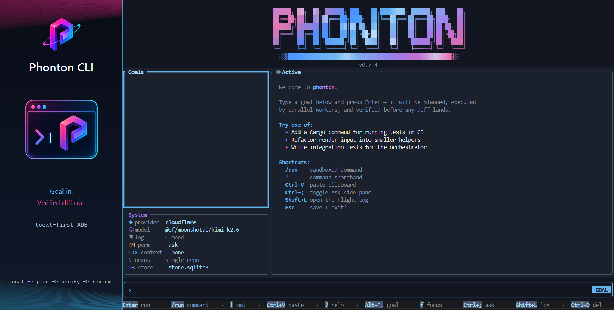
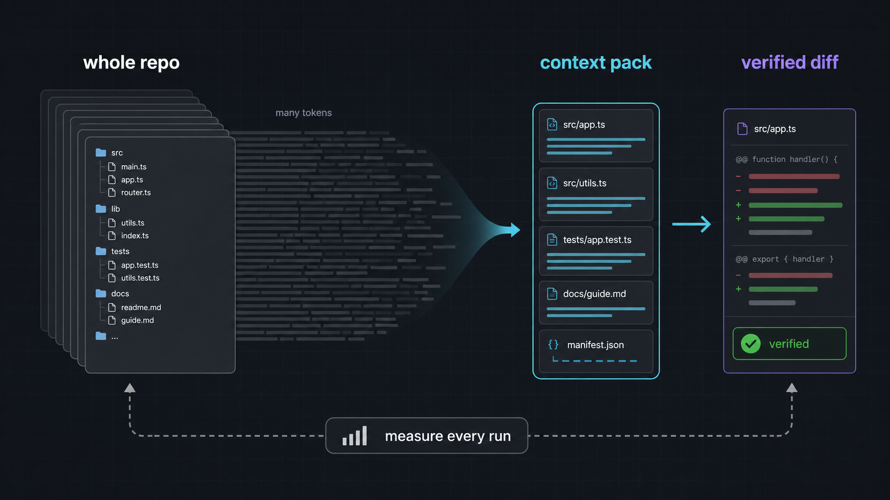
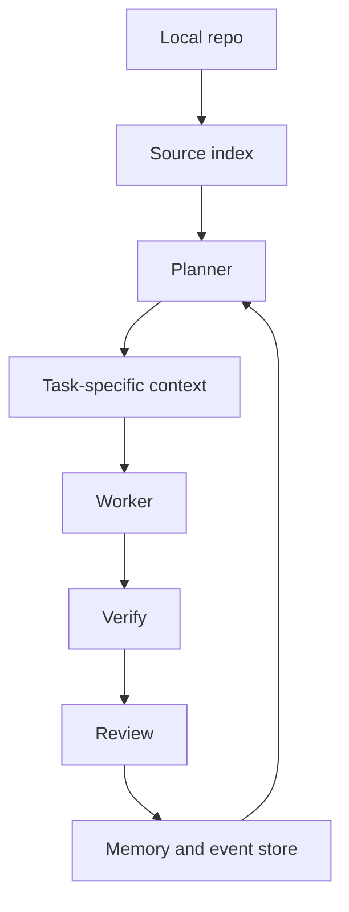
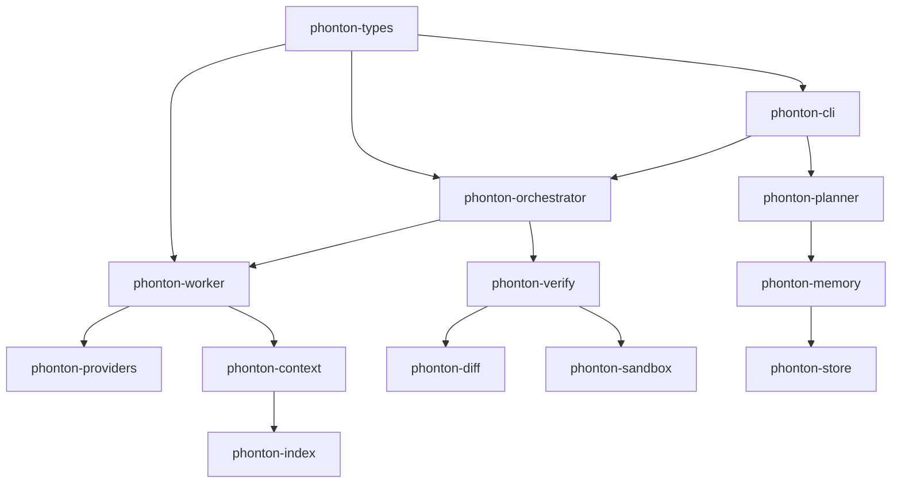

<p align="center">
  
</p>

<h1 align="center">Phonton CLI · v0.9.2</h1>

<p align="center">
  <strong>Verified code changes with repo memory.</strong><br>
  A local-first agentic development environment for developers who want autonomous code changes without giving up review control.
</p>

<p align="center">
  <a href="https://github.com/phonton-dev/phonton-cli/actions/workflows/ci.yml"></a>
  <a href="https://github.com/phonton-dev/phonton-cli/stargazers"></a>
  
  
  
</p>

---

Phonton plans the work, routes it through local repo context, verifies changes before handoff, and keeps the result reviewable. The goal is not to be the loudest coding agent. The goal is to make AI-assisted development feel less reckless.

> Current status: pre-1.0 public-alpha quality. The core loop is real, the CLI runs, and the Rust workspace is tested. Public launch claims should stay tied to reproducible benchmarks.

<p align="center">
  
</p>

## Why Phonton

Most coding agents start with chat. Phonton starts with the engineering loop:


That gives Phonton a different shape from an IDE assistant or a chat-first terminal assistant:

- **Review first:** plans and diffs are first-class surfaces, not buried in a conversation.
- **Verification first:** generated work is expected to pass checks before it is treated as ready.
- **Local first:** config, trust, store, memory, and repo context live on your machine.
- **BYOK:** use your own provider account instead of routing every task through a Phonton-hosted model bill.
- **Measured claims:** token and cost efficiency should be benchmarked per task, not guessed.

## Trust Demo Loop

The product promise is intentionally narrow:

```text
goal -> contract -> edit -> verify -> receipt -> remember
```

Try the proof-oriented demo text before configuring a provider:

```bash
phonton demo trust-loop
phonton demo trust-loop --json
```

It walks through the evidence trail a real run should expose: GoalContract, plan preview, verification failure and retry, review receipt, known gaps, rollback point, and memory prompt.

## What Works Today

- Interactive Ratatui TUI with goal, task, ask, settings, git, and flight-log surfaces.
- Unified slash commands in the TUI: `/settings`, `/config`, `/status`, `/context`, `/compact`, `/compress`, `/goals`, `/switch`, `/focus`, `/copy`, `/rerun`, `/stats`, `/stop`, `/review`, `/memory`, `/permissions`, `/trust`, `/model`, `/commands`, `/run`, and `!` all route through the same command registry and prompt drawer.
- Faster multi-goal navigation: the sidebar shows stable goal indexes, `Alt+Up` / `Alt+Down` switches goals even while drafting text, `Alt+1` through `Alt+9` jumps directly, and `/goals` opens a searchable switcher.
- Review-ready goals now default to a Code focus view when diff hunks are available, with Receipt, Code, Commands, and Log tabs in the Active panel plus `f` / `[` / `]` keyboard navigation.
- Command run receipts stay collapsed by default; the Commands focus view shows status, exit code, duration, and short stdout/stderr previews. `/rerun` repeats the latest command through the same sandbox path and `/copy` copies the current focus view to the Windows clipboard.
- Saved workspace sessions: use `phonton -r` or `phonton --resume` to reopen the last saved TUI conversation for the current repo.
- Prompt bar paste artifacts: long or multiline pasted text collapses into a compact colored chip while the full content stays attached to the submitted goal; credential-looking pasted blocks are blocked before they can reach the model.
- Image path paste/drop artifacts: pasted image file paths collapse into `[image: name.png]` chips and flow into the submitted prompt as image artifacts.
- Active review/code output is scrollable with the mouse wheel, `PgUp` / `PgDn`, and `Home` / `End`, so large generated diffs do not trap the user at the top of the receipt.
- Windows clipboard import in the TUI with `Ctrl+V`, including content selected from Windows clipboard history (`Win+V`) when the terminal does not emit bracketed paste directly.
- Lower-noise worker prompts: first attempts omit bulky diff examples, duplicate repo context slices are deduped, and Flight Log prompt manifests show repo-code, compaction, dedupe, and budget buckets.
- Resumed sessions keep recent prompt history, and the History view supports in-place filtering and row selection for inspecting previous task receipts.
- Workspace trust is saved as structured per-workspace records, mirrored into the local store, visible with `/trust current` or `/trust list`, and revocable with `/trust revoke-current`.
- Sandboxed command runs from the prompt bar with `/run <cmd>` or `!<cmd>`, plus command status, output previews, context meters, and permission mode controls in the TUI and Flight Log.
- `phonton doctor` setup diagnostics for config, provider key, store, trust, git, cargo, and Nexus config.
- `phonton plan` preview for task DAGs and the visible GoalContract before edits happen.
- `phonton review` surfaces for verified diff review payloads, approvals, rejections, rollback, and Markdown receipt export.
- `phonton run latest` executes the latest receipt-suggested run command through the sandbox.
- TUI goal prompts can mention workspace files and images with `@path`; text files become bounded context and image metadata/payloads flow to compatible providers.
- Review-ready runs now show a handoff receipt in the TUI and persist a minimal outcome ledger for history/review evidence.
- `phonton memory` commands for inspecting, editing, deleting, pinning, and unpinning local decision memory.
- `phonton extensions` commands for inspecting resolved skills, steering, MCP servers, profiles, conflicts, and diagnostics.
- `phonton mcp` commands for listing configured servers and lazily approving tool discovery or tool calls.
- BYOK provider adapters for Anthropic, OpenAI, OpenRouter, Gemini, Cloudflare Workers AI, AgentRouter, DeepSeek, xAI/Grok, Groq, Together, Ollama, and custom OpenAI-compatible endpoints. `phonton doctor --provider` verifies your configured provider by checking model discovery and a tiny completion call through the same adapter used for runs.
- Local store, memory, planner, worker, diff, sandbox, verification, and orchestration crates.
- Prompt-section token manifests in the Flight Log so system, goal, memory, attachment, MCP, and retry-context costs are inspectable.
- `phonton demo trust-loop` prints a compact proof-oriented walkthrough of the GoalContract -> verification -> receipt -> memory loop for first-run demos, with `--json` for reproducible demos.
- Semantic indexing behind the CLI stack for repo-aware workflows.

## What Is Still Early

Phonton is not yet as polished as Codex, Claude Code, Cursor, or Windsurf. It has fewer integrations, less onboarding polish, narrower public documentation, and no mature hosted/team workflow yet.

The current release target is a public alpha for real Rust repo tasks. Phonton can ask configured models to write app-sized changes, but quality is only claimed after plan review, sandboxed edits, verification, and human review. Use it if you are comfortable running a Rust binary, reading diagnostics, and filing sharp bug reports.

## Install

The easiest install path is npm. This downloads a prebuilt GitHub Release binary when the package installs.

```bash
npm install -g phonton-cli
phonton
```

Run without installing:

```bash
npx phonton-cli
```

Cargo still works if you prefer building from source. Rust is required for the Cargo path.

macOS/Linux:

```bash
curl -fsSL https://raw.githubusercontent.com/phonton-dev/phonton-cli/main/scripts/install.sh | sh
```

Windows PowerShell:

```powershell
& ([scriptblock]::Create((irm https://raw.githubusercontent.com/phonton-dev/phonton-cli/main/scripts/install.ps1)))
```

Direct Cargo install:

```bash
cargo install --git https://github.com/phonton-dev/phonton-cli --tag v0.9.2 phonton-cli --locked --force
```

Check the install:

```bash
phonton version
phonton doctor
```

## Release Channels

Phonton uses GitHub branches and releases as install channels:

| Channel | Install | Use when |
|---|---|---|
| Stable | `cargo install --git https://github.com/phonton-dev/phonton-cli --tag v0.9.2 phonton-cli --locked --force` | You want the best validated public alpha |
| Dev | `cargo install --git https://github.com/phonton-dev/phonton-cli --branch dev phonton-cli --locked --force` | You want next-release integration changes |
| Nightly | `cargo install --git https://github.com/phonton-dev/phonton-cli --branch nightly phonton-cli --locked --force` | You want daily snapshots and can tolerate breakage |
| Main | `cargo install --git https://github.com/phonton-dev/phonton-cli --branch main phonton-cli --locked --force` | You want the current release branch tip |

For the channel policy and automation, read [docs/RELEASE_CHANNELS.md](docs/RELEASE_CHANNELS.md).

## Build From Source

```bash
git clone https://github.com/phonton-dev/phonton-cli.git
cd phonton-cli
cargo build --release -p phonton-cli
```

Run the binary:

```bash
./target/release/phonton
```

On Windows:

```powershell
.\target\release\phonton.exe
```

## Configure A Provider

Phonton reads `~/.phonton/config.toml` and also checks provider-specific environment variables.

Minimal config:

```toml
[provider]
name = "gemini"
model = "gemma-4-31b-it"

[budget]
max_tokens = 120000
max_usd_cents = 200
```

Environment-variable setup examples:

```bash
export ANTHROPIC_API_KEY="..."
export OPENAI_API_KEY="..."
export GEMINI_API_KEY="..."
export OPENROUTER_API_KEY="..."
export CLOUDFLARE_API_TOKEN="..."
export CLOUDFLARE_ACCOUNT_ID="..."
```

Windows PowerShell:

```powershell
$env:GEMINI_API_KEY = "..."
$env:CLOUDFLARE_API_TOKEN = "..."
$env:CLOUDFLARE_ACCOUNT_ID = "..."
```

Cloudflare Workers AI uses the OpenAI-compatible endpoint. Set
`name = "cloudflare"` and the default model is `@cf/moonshotai/kimi-k2.6`.
Set `provider.account_id` or `CLOUDFLARE_ACCOUNT_ID` for the Workers AI account.
`provider.base_url` remains available for a full
`https://api.cloudflare.com/client/v4/accounts/<id>/ai/v1` base URL override.

Check the install:

```bash
phonton doctor
phonton doctor --provider
```

`phonton doctor --provider` proves the configured key/model/base URL can make a real completion call. It does not claim every listed provider works for every account, model name, quota state, or proxy configuration.

## CLI Commands

```text
phonton                 Launch the interactive TUI
phonton -r              Resume the saved TUI session for this workspace
phonton init            Create ~/.phonton/config.toml if it is missing
phonton ask <question>  One-shot Q&A using the configured provider
phonton demo trust-loop Print the evidence-trail demo loop
phonton doctor          Check config, store, trust, git, cargo, and Nexus
phonton plan <goal>     Preview the task DAG and GoalContract without changing files
phonton review          Show verified diff review payloads
phonton run latest      Run the latest receipt-suggested command
phonton memory list     Inspect local decision memory
phonton extensions list Inspect skills, steering, MCP servers, and profiles
phonton mcp list        Show configured MCP servers without starting them
phonton config path     Print the resolved config file path
phonton config show     Dump resolved config as TOML
phonton version         Print version
```

Inside the TUI prompt bar:

```text
/settings, /config      Open provider/model/budget settings
/status                 Show version, provider, model, workspace, and token state
/review                 Show review receipt guidance for the selected goal
/memory                 Inspect local decision memory
/permissions            Show sandbox, trust, and approval status
/trust                  Show or revoke workspace trust records
/model set <name>       Save a model preference
/commands               Show slash-command and keyboard help
/run <cmd>              Run a sandboxed command
!<cmd>                  Shorthand for a sandboxed command
Ctrl+V                  Paste from the Windows clipboard
Ctrl+U / Ctrl+K         Clear before / after cursor
PgUp / PgDn             Scroll the Active receipt/code surface
Mouse wheel             Scroll the visible Active or Flight Log surface
Tab                     Complete slash commands
```

Plan preview:

```bash
phonton plan --json "add input validation to config loading"
```

The text preview shows the visible GoalContract, including acceptance criteria,
likely files, verification plan, run plan, assumptions, and clarifications.

Review latest completed task:

```bash
phonton review latest
phonton review latest --markdown
phonton review approve latest
phonton review reject latest
```

Run the latest suggested command from a review receipt:

```bash
phonton run latest
phonton run latest --index 2
```

Memory management:

```bash
phonton memory list --json
phonton memory edit <id> "updated rationale"
phonton memory pin <id>
phonton memory delete <id>
```

Extension visibility:

```bash
phonton extensions list --json
phonton extensions doctor --json
phonton skills list --json
phonton steering list --json
phonton mcp list --json
```

## How Phonton Handles Context

<p align="center">
  
</p>

Phonton is built around a simple rule: do not blindly dump the whole repo into the model.



The intended result is lower context waste and better reviewability. The honest way to prove that is with benchmarks, so this repo includes a benchmark harness instead of hard-coded marketing numbers.

## Benchmarks

Run the plan benchmark harness:

```powershell
.\scripts\benchmark-plan.ps1
```

It runs repeatable planning tasks, captures estimated Phonton tokens versus the planner's naive baseline, and writes Markdown plus JSON reports to `benchmarks/results/`.

Read the methodology in [docs/BENCHMARKS.md](docs/BENCHMARKS.md).

Important: benchmark output is evidence, not a slogan. Do not claim "X percent savings" publicly until you can reproduce it on multiple real tasks and include the raw report.

## Architecture



Repository layout:

- `phonton-cli` - terminal UI and user-facing command surface.
- `phonton-planner` - goal decomposition and plan preview.
- `phonton-orchestrator` - task state, dependencies, retries, and event flow.
- `phonton-worker` - model-call loop, tool policy, and patch generation.
- `phonton-verify` - syntax/type/test/decision checks before review.
- `phonton-index` - local source indexing and semantic retrieval.
- `phonton-context` - task-specific context compilation.
- `phonton-diff` - diff application and rollback support.
- `phonton-memory` / `phonton-store` - local persistence and decision memory.
- `phonton-providers` - BYOK provider adapters.
- `phonton-sandbox` - command execution policy.
- `phonton-types` - shared domain contracts.

## Release Checks

Before cutting a release:

```powershell
.\scripts\release-check.ps1
```

The script runs formatting, clippy, tests, release build, doctor, and the plan benchmark harness.

Manual checks worth doing before a public release:

- Fresh clone install on Windows, macOS, and Linux.
- `phonton doctor --provider` with at least one hosted provider, confirming both model discovery and a completion call.
- One real repo task from goal to reviewable verified diff.
- Benchmark report committed or attached to the release notes.
- No secrets printed in logs, screenshots, or benchmark output.

## Comparison

Phonton is not trying to win by pretending the incumbents are weak.

| Tool | Strongest fit | Where Phonton is trying to be different |
|---|---|---|
| Codex | Mature agent workflow, cloud/editor/CLI integration | Local-first ADE kernel, BYOK, explicit verification and review surfaces |
| Claude Code | Excellent terminal-native coding agent | Less chat-first, more plan/verify/review oriented |
| Cursor | Polished AI editor experience | Less editor polish, more auditable repo workflow |
| Windsurf | Agentic IDE workflow | Narrower release scope, explicit local-first positioning |
| Phonton CLI | Verified local ADE loop for serious repo tasks | Early product, smaller ecosystem, benchmark claims still being built |

## Development

```bash
cargo fmt --all -- --check
cargo clippy --locked --workspace --all-targets -- -D warnings
cargo test --locked --workspace
cargo build --locked --release -p phonton-cli
```

Run from source:

```bash
cargo run -p phonton-cli -- doctor
cargo run -p phonton-cli -- plan "add input validation to config loading"
```

## License

Licensed under either of:

- Apache License, Version 2.0
- MIT License

at your option.

## Star History

[](https://www.star-history.com/?repos=phonton-dev%2Fphonton-cli&type=date&legend=top-left)
