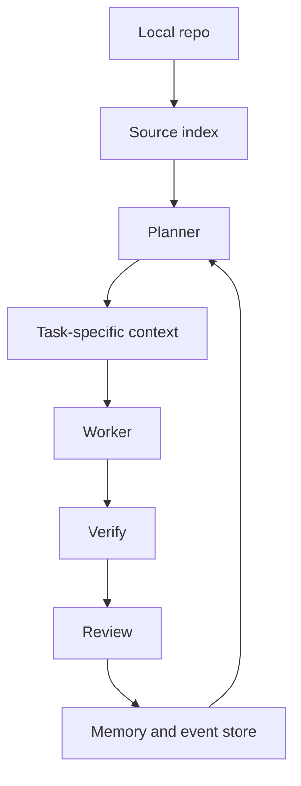
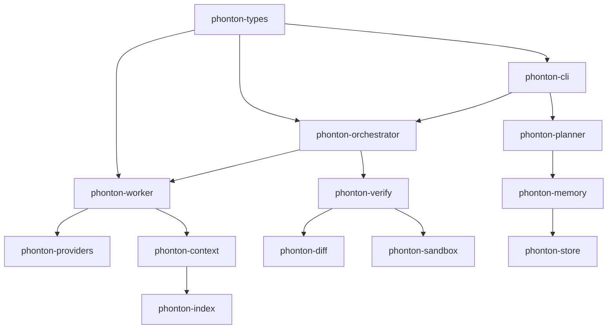

<p align="center">
  
</p>

<h1 align="center">Phonton CLI · v0.1.0</h1>

<p align="center">
  <strong>Verified code changes with repo memory.</strong><br>
  A local-first agentic development environment for developers who want autonomous code changes without giving up review control.
</p>

<p align="center">
  <a href="https://github.com/phonton-dev/phonton-cli/actions/workflows/ci.yml"></a>
  <a href="https://github.com/phonton-dev/phonton-cli/stargazers"></a>
  
  
  
</p>

---

Phonton plans the work, routes it through local repo context, verifies changes before handoff, and keeps the result reviewable. The goal is not to be the loudest coding agent. The goal is to make AI-assisted development feel less reckless.

> Current status: pre-1.0 public-alpha quality. The core loop is real, the CLI runs, and the Rust workspace is tested. Public launch claims should stay tied to reproducible benchmarks.

<p align="center">
  
</p>

## Why Phonton

Most coding agents start with chat. Phonton starts with the engineering loop:


That gives Phonton a different shape from an IDE assistant or a terminal chatbot:

- **Review first:** plans and diffs are first-class surfaces, not buried in a conversation.
- **Verification first:** generated work is expected to pass checks before it is treated as ready.
- **Local first:** config, trust, store, memory, and repo context live on your machine.
- **BYOK:** use your own provider account instead of routing every task through a Phonton-hosted model bill.
- **Measured claims:** token and cost efficiency should be benchmarked per task, not guessed.

## What Works Today

- Interactive Ratatui TUI with goal, task, ask, settings, git, and flight-log surfaces.
- `phonton doctor` setup diagnostics for config, provider key, store, trust, git, cargo, and Nexus config.
- `phonton plan` preview for task DAGs before edits happen.
- `phonton review` surfaces for verified diff review payloads, approvals, rejections, and rollback.
- BYOK provider support through the provider layer, including Anthropic, OpenAI, OpenRouter, Gemini, AgentRouter, DeepSeek, xAI/Grok, Groq, Together, Ollama, and custom OpenAI-compatible endpoints.
- Local store, memory, planner, worker, diff, sandbox, verification, and orchestration crates.
- Semantic indexing behind the CLI stack for repo-aware workflows.

## What Is Still Early

Phonton is not yet as polished as Codex, Claude Code, Cursor, or Windsurf. It has fewer integrations, less onboarding polish, narrower public documentation, and no mature hosted/team workflow yet.

The current release target is a public alpha for real Rust repo tasks. Use it if you are comfortable running a Rust binary, reading diagnostics, and filing sharp bug reports.

## Install

The easiest install path is npm. This downloads a prebuilt GitHub Release binary when the package installs.

```bash
npm install -g phonton-cli
phonton
```

Run without installing:

```bash
npx phonton-cli
```

Cargo still works if you prefer building from source. Rust is required for the Cargo path.

macOS/Linux:

```bash
curl -fsSL https://raw.githubusercontent.com/phonton-dev/phonton-cli/main/scripts/install.sh | sh
```

Windows PowerShell:

```powershell
& ([scriptblock]::Create((irm https://raw.githubusercontent.com/phonton-dev/phonton-cli/main/scripts/install.ps1)))
```

Direct Cargo install:

```bash
cargo install --git https://github.com/phonton-dev/phonton-cli --tag v0.1.0 phonton-cli --locked --force
```

Check the install:

```bash
phonton version
phonton doctor
```

## Release Channels

Phonton uses GitHub branches and releases as install channels:

| Channel | Install | Use when |
|---|---|---|
| Stable | `cargo install --git https://github.com/phonton-dev/phonton-cli --tag v0.1.0 phonton-cli --locked --force` | You want the best validated public alpha |
| Dev | `cargo install --git https://github.com/phonton-dev/phonton-cli --branch dev phonton-cli --locked --force` | You want next-release integration changes |
| Nightly | `cargo install --git https://github.com/phonton-dev/phonton-cli --branch nightly phonton-cli --locked --force` | You want daily snapshots and can tolerate breakage |
| Main | `cargo install --git https://github.com/phonton-dev/phonton-cli --branch main phonton-cli --locked --force` | You want the current release branch tip |

For the channel policy and automation, read [docs/RELEASE_CHANNELS.md](docs/RELEASE_CHANNELS.md).

## Build From Source

```bash
git clone https://github.com/phonton-dev/phonton-cli.git
cd phonton-cli
cargo build --release -p phonton-cli
```

Run the binary:

```bash
./target/release/phonton
```

On Windows:

```powershell
.\target\release\phonton.exe
```

## Configure A Provider

Phonton reads `~/.phonton/config.toml` and also checks provider-specific environment variables.

Minimal config:

```toml
[provider]
name = "gemini"
model = "gemma-4-31b-it"

[budget]
max_tokens = 120000
max_usd_cents = 200
```

Environment-variable setup examples:

```bash
export ANTHROPIC_API_KEY="..."
export OPENAI_API_KEY="..."
export GEMINI_API_KEY="..."
export OPENROUTER_API_KEY="..."
```

Windows PowerShell:

```powershell
$env:GEMINI_API_KEY = "..."
```

Check the install:

```bash
phonton doctor
phonton doctor --provider
```

## CLI Commands

```text
phonton                 Launch the interactive TUI
phonton ask <question>  One-shot Q&A using the configured provider
phonton doctor          Check config, store, trust, git, cargo, and Nexus
phonton plan <goal>     Preview the task DAG without changing files
phonton review          Show verified diff review payloads
phonton config path     Print the resolved config file path
phonton config show     Dump resolved config as TOML
phonton version         Print version
```

Plan preview:

```bash
phonton plan --json "add input validation to config loading"
```

Review latest completed task:

```bash
phonton review latest
phonton review approve latest
phonton review reject latest
```

## How Phonton Handles Context

<p align="center">
  
</p>

Phonton is built around a simple rule: do not blindly dump the whole repo into the model.



The intended result is lower context waste and better reviewability. The honest way to prove that is with benchmarks, so this repo includes a benchmark harness instead of hard-coded marketing numbers.

## Benchmarks

Run the plan benchmark harness:

```powershell
.\scripts\benchmark-plan.ps1
```

It runs repeatable planning tasks, captures estimated Phonton tokens versus the planner's naive baseline, and writes Markdown plus JSON reports to `benchmarks/results/`.

Read the methodology in [docs/BENCHMARKS.md](docs/BENCHMARKS.md).

Important: benchmark output is evidence, not a slogan. Do not claim "X percent savings" publicly until you can reproduce it on multiple real tasks and include the raw report.

## Architecture



Repository layout:

- `phonton-cli` - terminal UI and user-facing command surface.
- `phonton-planner` - goal decomposition and plan preview.
- `phonton-orchestrator` - task state, dependencies, retries, and event flow.
- `phonton-worker` - model-call loop, tool policy, and patch generation.
- `phonton-verify` - syntax/type/test/decision checks before review.
- `phonton-index` - local source indexing and semantic retrieval.
- `phonton-context` - task-specific context compilation.
- `phonton-diff` - diff application and rollback support.
- `phonton-memory` / `phonton-store` - local persistence and decision memory.
- `phonton-providers` - BYOK provider adapters.
- `phonton-sandbox` - command execution policy.
- `phonton-types` - shared domain contracts.

## Release Checks

Before cutting a release:

```powershell
.\scripts\release-check.ps1
```

The script runs formatting, clippy, tests, release build, doctor, and the plan benchmark harness.

Manual checks worth doing before a public release:

- Fresh clone install on Windows, macOS, and Linux.
- `phonton doctor --provider` with at least one hosted provider.
- One real repo task from goal to reviewable verified diff.
- Benchmark report committed or attached to the release notes.
- No secrets printed in logs, screenshots, or benchmark output.

## Comparison

Phonton is not trying to win by pretending the incumbents are weak.

| Tool | Strongest fit | Where Phonton is trying to be different |
|---|---|---|
| Codex | Mature agent workflow, cloud/editor/CLI integration | Local-first ADE kernel, BYOK, explicit verification and review surfaces |
| Claude Code | Excellent terminal-native coding agent | Less chat-first, more plan/verify/review oriented |
| Cursor | Polished AI editor experience | Less editor polish, more auditable repo workflow |
| Windsurf | Agentic IDE workflow | Narrower release scope, stronger local-first positioning |
| Phonton CLI | Verified local ADE loop for serious repo tasks | Early product, smaller ecosystem, benchmark claims still being built |

## Development

```bash
cargo fmt --all -- --check
cargo clippy --locked --workspace --all-targets -- -D warnings
cargo test --locked --workspace
cargo build --locked --release -p phonton-cli
```

Run from source:

```bash
cargo run -p phonton-cli -- doctor
cargo run -p phonton-cli -- plan "add input validation to config loading"
```

## License

Licensed under either of:

- Apache License, Version 2.0
- MIT License

at your option.

## Star History

[](https://www.star-history.com/?repos=phonton-dev%2Fphonton-cli&type=date&legend=top-left)
