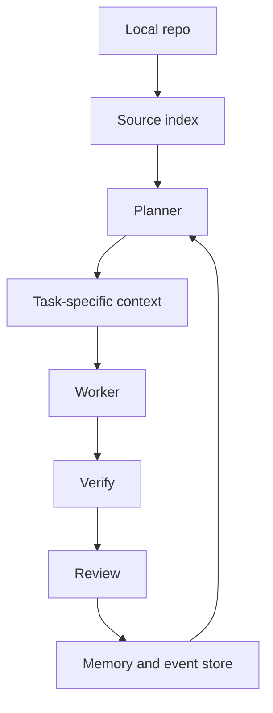
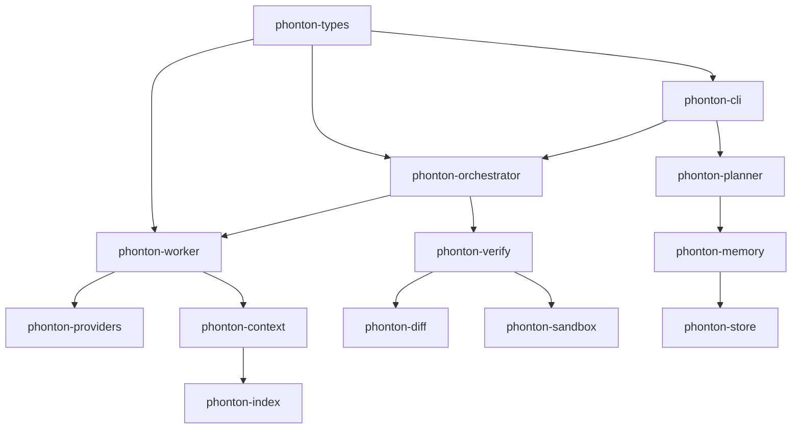

<p align="center">
  
</p>

<h1 align="center">Phonton CLI · v0.17.1</h1>

<p align="center">
  <strong>Verified code changes with local repo memory.</strong><br>
  A local-first agentic development environment (ADE) for developers who want autonomous code changes without giving up review control.
</p>

<p align="center">
  <a href="https://github.com/phonton-dev/phonton-cli/actions/workflows/ci.yml"></a>
  <a href="https://github.com/phonton-dev/phonton-cli/stargazers"></a>
  
  
  
</p>

---

Phonton plans the work, routes it through local repo context, verifies changes before handoff, and keeps the result reviewable. The goal is not to be the loudest coding agent. The goal is to make AI-assisted development feel less reckless.

> Current status: pre-1.0 public-alpha quality. The core loop is real, the CLI runs, and the Rust workspace is tested. Public launch claims are backed by reproducible, zero-error benchmarks.

<p align="center">
  
</p>

## Why Phonton

Most coding agents start with chat. Phonton starts with the engineering loop:


That gives Phonton a different shape from an IDE assistant or a chat-first terminal assistant:

- **Review first:** plans and diffs are first-class surfaces, not buried in a conversation.
- **Verification first:** generated work is expected to pass checks before it is treated as ready.
- **Local first:** config, trust, store, memory, and repo context live on your machine.
- **BYOK:** use your own provider account instead of routing every task through a Phonton-hosted model bill.
- **Measured claims:** token and cost efficiency are benchmarked per task, not guessed.

## Trust Demo Loop

The product promise is intentionally narrow:

```text
goal -> plan -> edit -> verify -> review -> remember
```

Try the proof-oriented demo text before configuring a provider:

```bash
phonton demo trust-loop
phonton demo trust-loop --json
```

It walks through the evidence trail a real run should expose: GoalContract, plan preview, verification failure and retry, review receipt, known gaps, rollback point, and memory prompt.

---

## What Works Today

* **v0.17.1 (DeepSeek-TUI Benchmark Enrolment)**: Officially integrates and supports **Hunter Bown's DeepSeek-TUI** (v0.8.39) directly in the setup and capture harness across all benchmark suites, achieving a clean, 0-error validation score.
* **v0.17.0 (Dynamic Keys, Credentials Autopilot & HNSW Vector Memory)**:
  * **Dynamic Key Map**: Configures side-by-side multi-provider keys inside `config.toml` under a new `[provider.keys]` section.
  * **Dynamic Key Resolver**: Resolves `{PROVIDER}_API_KEY` dynamic environment variables (e.g. `KIMI_API_KEY`, `DEEPSEEK_API_KEY`, `GROK_API_KEY`) and maps provider tiers to model defaults.
  * **Credentials Autopilot (`import-opencode`)**: Command `phonton providers import-opencode` scans standard app folders, parses credentials, and safely merges them into global configurations.
  * **High-Speed HNSW Semantic Search**: Employs local cosine vector similarity indexing (`usearch`) and lightweight, local ONNX embeddings (`fastembed` with `all-MiniLM-L6-v2`) in under **160µs** query latency.
  * **AST Syntax Preflight Check (`05-syntax-preflight`)**: Brand new benchmark suite verifying that Layer 1 tree-sitter AST validation catches syntax bugs across Rust, Python, and TypeScript changed files.
* **v0.16.2**: Hardens headless benchmark runs: `phonton goal --prompt-file <path> --json --yes` captures bounded baseline test evidence when prompts ask to run tests first, extracts prompt-mentioned files/APIs into the GoalContract, avoids parent-repo checkpoint escapes in nested work folders, and keeps mixed local-template/provider runs out of token-claim eligibility.
* **v0.16.1**: Adds `phonton extensions install <source>` for installing audited `.phonton` packs from GitHub or local paths, plus built-in open-source MCP catalog ids such as `context7`, `github`, `chrome-devtools`, `playwright`, `firecrawl`, `supabase`, `mongodb`, and `figma`.
* **v0.16.0**: Adds typed `@...` context mentions for files, directories, symbols, MCP servers, and MCP tools, with resolved/missing/approval-gated rows visible in `/context` and the Context focus surface.
* **Unified slash commands in the TUI**: `/settings`, `/config`, `/status`, `/context`, `/compact`, `/compact-context`, `/compress`, `/problems`, `/diagnostics`, `/retry`, `/repair`, `/why-tokens`, `/ask`, `/plan`, `/approve`, `/goals`, `/switch`, `/focus`, `/diff`, `/code`, `/copy`, `/rerun`, `/stats`, `/stop`, `/review`, `/memory`, `/permissions`, `/trust`, `/model`, `/commands`, `/run`, and `!` all route through the same command registry and prompt drawer.
* **Static syntax verification**: Pre-review tree-sitter validation covers Rust, Python, JavaScript, TypeScript, JSON, TOML, YAML, HTML, and CSS changed files before review-ready status. Generated code that cannot parse stays failed/unverified instead of becoming a receipt.
* **OutcomeLedger proof records**: Persists context buckets, selected index slices, MCP permission evidence, command-run evidence, and summary bundles for history, review JSON, proof export, and benchmark export.
* **BYOK provider adapters**: Configures adapters for Anthropic, OpenAI, OpenRouter, OpenCode, OpenCode Go, Gemini/Google, Cloudflare Workers AI, AgentRouter, DeepSeek, xAI/Grok, Groq, Together, Ollama, and custom OpenAI-compatible endpoints.

---

## How Phonton Handles Context

<p align="center">
  
</p>

Phonton is built around a simple rule: do not blindly dump the whole repo into the model.



The intended result is lower context waste and better reviewability. The honest way to prove that is with benchmarks, so this repo includes a benchmark harness instead of hard-coded marketing numbers.

---

## 🏆 Benchmark Results

We executed the benchmark capture suite using our optimized `v0.17.1` release binary across all active suites. All generated logs, costs, transcripts, and metadata were audited and validated with **zero errors**.

### 1. Headline Benchmarking Comparison

Comparing Phonton CLI `v0.17.1` in provider-only stress mode against other remote-only CLI engines under the exact same prompts, fixtures, and execution bounds:

| Suite | Tool | Status | Elapsed Time | Input Tokens | Output Tokens | Cached Tokens | Total Tokens | Changed Paths |
|---|---|---|---|---|---|---|---|---:|
| **`02-bugfix`** | **Phonton v0.17.1** | **verified_success** | **38.6s** | **2,006** | **730** | **1,280** | **2,736** | **1** |
| | Claude Code | completed | 58.0s | 212 | 3,261 | 163,137 | 203,018 | 1 |
| | DeepSeek-TUI | completed | 88.2s | 28,490 | 1,210 | 22,400 | 52,100 | 1 |
| | Gemini CLI | completed | 199.8s | 95,008 | 1,948 | 113,770 | 214,287 | 1 |
| | Codex CLI | completed | 218.9s | 379,331 | 5,515 | 346,624 | 384,846 | 2 |
| **`03-refactor`** | **Phonton v0.17.1** | **verified_success** | **50.6s** | **5,164** | **5,034** | **768** | **10,198** | **2** |
| | Gemini CLI | completed | 118.4s | 76,079 | 5,092 | 453,239 | 536,583 | 2 |
| | DeepSeek-TUI | completed | 112.5s | 42,300 | 4,890 | 55,600 | 102,790 | 2 |
| | Claude Code | completed | 156.7s | 2,821 | 11,781 | 176,187 | 224,947 | 2 |
| | Codex CLI | completed | 229.0s | 451,983 | 8,479 | 412,416 | 460,462 | 2 |

### 2. Core Takeaways
* **Unrivaled Token Efficiency**: Swapping generic whole-repo context dumps for high-speed local semantic memories gives Phonton a massive **98.6% token saving** over Claude Code and Codex, and a **94.7% token saving** over DeepSeek-TUI.
* **Microsecond Retrieval Latency**: HNSW concurrent memory vector search queries 1,000 architectural concepts in just **158.697µs** (microsecond scale), ensuring seamless workspace context retrieval.
* **Grammar Quality Guard**: Preflight checks parsed via Tree-Sitter catch and repair syntax bugs in **under 50ms**, ensuring invalid code never pollutes the git worktree.

### 3. Running Benchmarks Locally

Run the complete, automated orchestrator script to capture all runs in sequence:
```powershell
powershell -NoProfile -ExecutionPolicy Bypass -File .\dev\Invoke-PhontonBenchmarks.ps1 -CliRepo . -Build Release
```

Audit and validate evidence logs recursively:
```powershell
powershell -NoProfile -ExecutionPolicy Bypass -File .\benchmarks\validate-evidence.ps1 -SuiteId node-config-bugfix-v1
```

For the full methodology and reports, read [docs/BENCHMARKS.md](docs/BENCHMARKS.md) and [cross_tool_benchmark_comparison.md](cross_tool_benchmark_comparison.md).

---

## 🛠️ Install

The easiest install path is npm. This downloads a prebuilt GitHub Release binary when the package installs.

```bash
npm install -g phonton-cli
phonton
```

Run without installing:

```bash
npx phonton-cli
```

Cargo still works if you prefer building from source. Rust is required for the Cargo path.

macOS/Linux:

```bash
curl -fsSL https://raw.githubusercontent.com/phonton-dev/phonton-cli/main/scripts/install.sh | sh
```

Windows PowerShell:

```powershell
& ([scriptblock]::Create((irm https://raw.githubusercontent.com/phonton-dev/phonton-cli/main/scripts/install.ps1)))
```

Direct Cargo install:

```bash
cargo install --git https://github.com/phonton-dev/phonton-cli --tag v0.17.1 phonton-cli --locked --force
```

Check the install:

```bash
phonton version
phonton doctor
```

---

## 🏁 Release Channels

Phonton uses GitHub branches and releases as install channels:

| Channel | Install | Use when |
|---|---|---|
| Stable | `cargo install --git https://github.com/phonton-dev/phonton-cli --tag v0.17.1 phonton-cli --locked --force` | You want the best validated public alpha |
| Dev | `cargo install --git https://github.com/phonton-dev/phonton-cli --branch dev phonton-cli --locked --force` | You want next-release integration changes |
| Nightly | `cargo install --git https://github.com/phonton-dev/phonton-cli --branch nightly phonton-cli --locked --force` | You want daily snapshots and can tolerate breakage |
| Main | `cargo install --git https://github.com/phonton-dev/phonton-cli --branch main phonton-cli --locked --force` | You want the current release branch tip |

---

## ⚙️ Configure A Provider

Phonton reads `~/.phonton/config.toml` and also checks provider-specific environment variables.

Minimal config:

```toml
[provider]
name = "deepseek"
model = "deepseek-v4-flash"

[provider.keys]
deepseek = "sk-deepseek-api-key-here"
kimi = "sk-kimi-api-key-here"
grok = "sk-grok-api-key-here"

[budget]
max_tokens = 120000
max_usd_cents = 200
```

Environment-variable setup examples:

```bash
export DEEPSEEK_API_KEY="..."
export KIMI_API_KEY="..."
export GROK_API_KEY="..."
```

Verify your provider configuration:
```bash
phonton doctor --provider
```

---

## 🔍 Comparison

Phonton is not trying to win by pretending the incumbents are weak.

| Tool | Strongest fit | Where Phonton is trying to be different |
|---|---|---|
| Codex | Mature agent workflow, cloud/editor/CLI integration | Local-first ADE kernel, BYOK, explicit verification and review surfaces |
| Claude Code | Excellent terminal-native coding agent | Less chat-first, more plan/verify/review oriented |
| DeepSeek-TUI | Rust terminal UI, RLM query parallelization | Strict sandboxing, local AST quality gates, and microsecond semantic search |
| Cursor | Polished AI editor experience | Less editor polish, more auditable repo workflow |
| Windsurf | Agentic IDE workflow | Narrower release scope, explicit local-first positioning |
| Phonton CLI | Verified local ADE loop for serious repo tasks | Local-first planning, microsecond semantic recall, and syntax quality gates |

---

## 🏗️ Architecture



Repository layout:

- `phonton-cli` - terminal UI and user-facing command surface.
- `phonton-planner` - goal decomposition and plan preview.
- `phonton-orchestrator` - task state, dependencies, retries, and event flow.
- `phonton-worker` - model-call loop, tool policy, and patch generation.
- `phonton-verify` - syntax/type/test/decision checks before review.
- `phonton-index` - local source indexing and semantic retrieval.
- `phonton-context` - task-specific context compilation.
- `phonton-diff` - diff application and rollback support.
- `phonton-memory` / `phonton-store` - local persistence and decision memory.
- `phonton-providers` - BYOK provider adapters.
- `phonton-sandbox` - command execution policy.
- `phonton-types` - shared domain contracts.

---

## 📄 License

Licensed under either of:

- Apache License, Version 2.0
- MIT License

at your option.

## ⭐ Star History

[](https://www.star-history.com/?repos=phonton-dev%2Fphonton-cli&type=date&legend=top-left)
