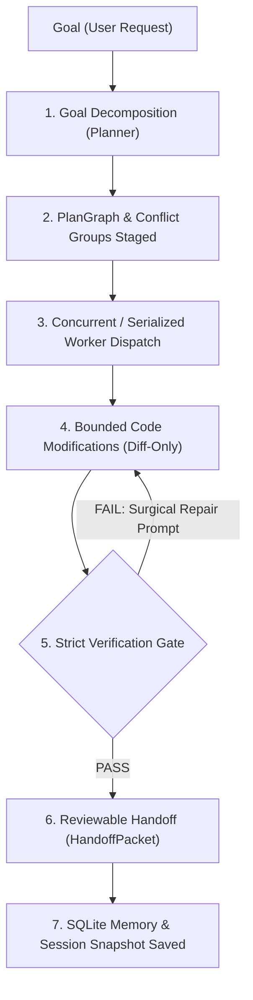

<p align="center">
  
</p>

<h1 align="center">Phonton CLI — v0.19.0</h1>

<p align="center">
  <strong>Your keys. Your code. The autonomous coding agent that never phones home.</strong><br>
  Phonton is a local-first agentic development environment (ADE) built around the loop: <code>goal ➔ plan ➔ edit ➔ verify ➔ review ➔ remember</code>.
</p>

<p align="center">
  <a href="https://github.com/phonton-dev/phonton-cli/actions/workflows/ci.yml"></a>
  <a href="https://github.com/phonton-dev/phonton-cli/stargazers"></a>
  
  
</p>

---

## 💡 What is Phonton?

Every AI coding assistant makes you trade privacy for autonomy. To get an agentic experience, you either hand your code to a SaaS vendor's proxy servers, or settle for inline autocompletion. 

**Phonton is the first tool to deliver both: fully agentic development and absolute, uncompromising privacy.**

Phonton runs as a local-first, headless-ready terminal tool. Your code never leaves your machine. Your API keys go straight to Anthropic, OpenAI, Gemini, or Ollama. No intermediate proxy, no telemetry hooks, and no subscription required. 

<p align="center">
  
</p>

---

## 🌟 Core Differentiators

### 1. Zero-Telemetry BYOK (Bring Your Own Key)
Phonton is proxy-free. Requests go directly to `api.anthropic.com`, `api.openai.com`, `generativelanguage.googleapis.com`, or your local `ollama` daemon. Phonton never intercepts your keys and never touches your code in transit. You can packet-capture the network to verify.

### 2. The Strict 4-Layer Verification Gate
Unlike other tools that silently write code and let LLM hallucinations ship, Phonton enforces a strict verification gate. Every diff must pass through **four layers** before it is marked as review-ready:
1. **Tree-Sitter Syntax check**
2. **Crate check (`cargo check`)**
3. **Workspace Check (Lints & Format)**
4. **Automated Test suite execution**
5. **Interactive Browser rendering check** (Playwright checks + Screenshots in `v0.19.0`)

On failure, verifier diagnostics are surgically fed back to the worker for recursive repair loops.

### 3. Multi-Model Intelligence Routing
Phonton routes subtasks by complexity using tiered model mapping (`Local ➔ Cheap ➔ Standard ➔ Frontier`). It automatically escalates to a more powerful model only on verify failure. You pay pennies for boilerplate and invoke frontier intelligence only when a task demands it.

### 4. Semantic Memory Across Sessions
Phonton maintains a persistent SQLite store of architectural decisions, rejected approaches, and task history. The planner consults this memory on every goal decomposition, ensuring it never re-attempts approaches that failed before and builds upon approved design patterns.

---

## ⚡ Quick Install

The easiest path to install is via npm. The wrapper automatically downloads the prebuilt binary for your platform.

```bash
# Install globally
npm install -g phonton-cli

# Verify your installation
phonton version
phonton doctor
```

### Alternative Installers

* **Shell Script (macOS/Linux)**:
  ```bash
  curl -fsSL https://raw.githubusercontent.com/phonton-dev/phonton-cli/main/scripts/install.sh | sh
  ```
* **PowerShell (Windows)**:
  ```powershell
  & ([scriptblock]::Create((irm https://raw.githubusercontent.com/phonton-dev/phonton-cli/main/scripts/install.ps1)))
  ```
* **Cargo (From Source)**:
  ```bash
  cargo install --git https://github.com/phonton-dev/phonton-cli --tag v0.19.0 phonton-cli --locked --force
  ```

---

## ⚖️ How We Compare

| Feature | Phonton CLI | Claude Code | Cursor | Aider |
|---|---|---|---|---|
| **Privacy Model** | **100% Direct (No Proxy)** | Anthropic Proxy | Cursor Proxy | Direct (No Proxy) |
| **Telemetry** | **Zero** | Opt-out | Opt-out | Optional |
| **Multi-Model Support** | **All (BYOK & Local)** | Anthropic Only | Pre-selected | Many |
| **Subscription Fee** | **$0 (Open Source)** | Usage-based | $20/month | $0 (Open Source) |
| **Execution Loop** | **Full Plan/Edit/Verify** | Interactive Chat | Interactive Chat | Interactive Chat |
| **Verification Gates** | **Mandatory 4-Layer** | Manual/Run Command | Manual | Optional |
| **Memory Spine** | **Semantic SQLite** | None | Simple Context | None |

---

## 🔄 The Autonomous ADE Loop



---

## 🚀 New in v0.19.0: Swarm Planning & Pluggable Indices

* **Conflict-Aware Swarm Scheduling (`PlanGraph`)**: Broad goals are decomposed into collaborative swarms. Overlapping touch scopes are isolated into Conflict Groups and serialized, while independent subtasks run concurrently to optimize execution time.
* **Pluggable Code Indexing**: Upgraded `phonton-index` with a pluggable `CodeRetriever` trait. Supports default high-performance `local-hnsw` search and external `qdrant` HTTP vector storage for larger enterprise repositories.
* **Dynamic MCP Capability Discovery**: Run `phonton mcp capabilities <server-id> [--yes]` to preview server info, exposed tools, and sandbox permission proposals safely before initiating any tool execution.
* **Robust Browser Verification**: Dynamically injected `NODE_PATH` resolution guarantees Playwright DOM and interaction tests run flawlessly on isolated temp directories and production workspaces alike.

---

## ⚙️ Configuration

Configure your direct providers and indexing backend in `~/.phonton/config.toml`:

```toml
[provider]
name = "deepseek"
model = "deepseek-v4-flash"

[provider.keys]
deepseek = "sk-deepseek-api-key-here"
anthropic = "sk-ant-api-key-here"
openai = "sk-proj-openai-key-here"

[index]
backend = "local-hnsw"
```

To enable the external **Qdrant** backend:

```toml
[index]
backend = "qdrant"
qdrant_url = "http://127.0.0.1:6333"
qdrant_collection = "phonton-code"
```

---

## 🛠️ Commands Reference

```bash
# Launch the interactive Ratatui TUI
phonton

# Run a goal non-interactively through the full plan/edit/verify pipeline
phonton goal "add input validation to config loading" --yes

# Preview the subtask graph and Conflict Groups without editing files
phonton plan "refactor auth layer"

# Audit configuration, API keys, database, and vector index connectivity
phonton doctor --provider

# Export benchmark telemetry from the latest run
phonton benchmark export --latest --format json
```

---

## 🗺️ Crate Architecture

Phonton is written entirely in Rust for performance, correctness, and low memory overhead:
* `phonton-cli`: Interactive TUI, headless runner, benchmark, and CLI commands.
* `phonton-planner`: Multi-model goal decomposition and `PlanGraph` sidecar staging.
* `phonton-orchestrator`: Swarm scheduler, Conflict Group serialization, and verifier pipeline execution.
* `phonton-worker`: Highly optimized context assembler and diff-only code modifier.
* `phonton-index`: Local HNSW symbol index and Qdrant integration.
* `phonton-verify`: Four-layer static checkers (Tree-Sitter, Cargo, Playwright Browser/Screenshot).
* `phonton-mcp`: Lazy initialization client, permission gates, and capabilities descriptor.

---

## 💖 Star History

If you support a privacy-first, fully autonomous developer experience, please leave us a star!

[](https://www.star-history.com/?repos=phonton-dev%2Fphonton-cli&type=date&legend=top-left)

---

## 📄 License

Licensed under either of:
* Apache License, Version 2.0 ([LICENSE-APACHE](LICENSE-APACHE))
* MIT License ([LICENSE-MIT](LICENSE-MIT))

At your option.
