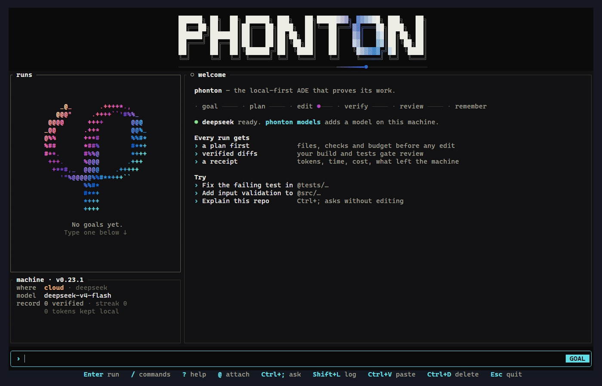

<p align="center">
  
</p>

<h1 align="center">Phonton</h1>

<p align="center">
  <strong>The local-first ADE that proves its work.</strong><br>
  Give it a goal. It shows a plan, writes diffs, runs your checks, and hands you
  a receipt: what changed, what passed, and what it cost.
</p>

<p align="center">
  <a href="https://github.com/phonton-dev/phonton-cli/actions/workflows/ci.yml"></a>
  <a href="https://github.com/phonton-dev/phonton-cli/stargazers"></a>
  
  
</p>

<p align="center">
  <a href="https://phonton.dev">Website</a> ·
  <a href="docs/getting-started.md">Getting started</a> ·
  <a href="https://discord.gg/avcJb4PjhM">Discord</a>
</p>

<p align="center">
  
</p>

---

<p align="center">
  <br>
  <sub>Real recording (sped up): two failing tests in, a verified diff and receipt out.</sub>
</p>

## 60-second start

```bash
npm install -g phonton-cli
phonton doctor     # checks your provider key, git, and local tools
phonton            # opens the TUI; type a goal and press Enter
```

No account, no Phonton server. Bring a key from Anthropic, OpenAI, DeepSeek,
OpenRouter, Gemini, Groq and others, or run on local models (preview, below).

## What a run looks like

From the recorded run above (DeepSeek Flash, small JavaScript repo):

```text
goal     Make parsePort reject ports outside 1-65535 and trailing garbage
plan     1 subtask, verify with the repo's own `node --test`
edit     unified diff against the exact current src/port.js
verify   patch applies · syntax · tests: 3 pass, 0 fail (was 1 pass, 2 fail)
review   receipt: 1 file (+6/-2) · 8.8k tokens · est. $0.003 · checkpoint #1
remember completion stored locally for the next goal
```

Nothing lands in your tree until it passes verification, and every run leaves a
receipt you can audit with `phonton review latest` and `phonton why-tokens`.

## Why Phonton

- **Plan before edits.** Each goal becomes a visible `GoalContract` with
  acceptance criteria and a verify plan before any worker starts.
- **Diffs, not rewrites.** Workers return unified diffs against the current
  source. No prose, no whole-file regeneration.
- **Verification gates review.** Patch apply, syntax, decision memory, Cargo,
  Node and browser checks decide what is review-ready. Failures repair first,
  then escalate to a stronger model.
- **Receipts with real numbers.** Changed files, checks, provider-reported
  tokens, cost, and rollback points in a typed `HandoffPacket`.
- **Local memory.** Decisions, rejected approaches and conventions live in
  local SQLite and steer the next plan.
- **Designed for context efficiency.** Workers get only the files they edit
  plus retrieved symbols; finished subtasks are carried forward as one-line
  notes instead of full transcripts; cheap models go first. We publish
  measurements only with reproducible artifacts; see
  [Benchmark honesty](#benchmark-honesty).

## Local models (preview)

This branch adds a shared local model manager and a bounded local candidate
runner on Ollama. It is a source-build preview, not yet in the npm package.

```bash
phonton models status              # hardware, runtime, installed models
phonton models setup               # managed Ollama runtime
phonton models install qwen2.5-coder:1.5b
phonton models calibrate qwen2.5-coder:1.5b
phonton models select qwen2.5-coder:1.5b
phonton goal --local --plan "Fix parsePort validation" --repo ./my-project
phonton goal --local "Fix parsePort validation" --repo ./my-project
phonton goal --local apply RUN_ID --yes    # after reviewing the verified candidate
```

Local runs never silently fall back to a cloud model. Full workflow, permissions
and limits: [docs/local-harness.md](docs/local-harness.md) and the
[local harness reference](docs/local-harness-reference.md).

Local source snapshots omit generated `__pycache__` and `.pytest_cache`
directories. Baseline and candidate checks still reject changed source bytes,
unexpected source files, and changes to captured root-level bytecode.

---

## Install

```bash
npm install -g phonton-cli
```

From source:

```bash
cargo install --git https://github.com/phonton-dev/phonton-cli phonton-cli --locked --force
```

Script installers:

```bash
curl -fsSL https://raw.githubusercontent.com/phonton-dev/phonton-cli/main/scripts/install.sh | sh
```

```powershell
& ([scriptblock]::Create((irm https://raw.githubusercontent.com/phonton-dev/phonton-cli/main/scripts/install.ps1)))
```

---

## Commands

```bash
# Launch the interactive Ratatui TUI
phonton

# Run a goal non-interactively through plan/edit/verify/review
phonton goal "add input validation to config loading" --yes --allow-host-checks

# Run an exact prompt file, useful for benchmark and CI harnesses
phonton goal --prompt-file prompt.md --yes --allow-host-checks --json

# Preview the task graph and GoalContract without editing files
phonton plan --json "refactor auth layer"

# Audit configuration, providers, store, trust, git, Cargo, and index backend
phonton doctor --provider

# See where the latest goal spent tokens
phonton why-tokens

# Review the latest receipt, then export typed proof
phonton review latest
phonton proof export --latest --format json

# Inspect MCP capability proposals without invoking tools
phonton mcp capabilities <server-id> --json
```

---

## Configuration

Configure providers and the code index in `~/.phonton/config.toml`:
Set `PHONTON_CONFIG_PATH` to an absolute config path outside repositories for
an isolated CLI run. Local-model state stays at its usual location unless
`PHONTON_LOCAL_STATE` is also set. Provider keys can remain in process
environment variables instead of the isolated file; config-file keys take
precedence when present. The normal config is left untouched.

```toml
[provider]
name = "deepseek"
model = "deepseek-flash"

[provider.keys]
deepseek = "sk-deepseek-api-key-here"
anthropic = "sk-ant-api-key-here"
openai = "sk-proj-openai-key-here"

[index]
backend = "local-hnsw"
```

Optional Qdrant code retrieval:

```toml
[index]
backend = "qdrant"
qdrant_url = "http://127.0.0.1:6333"
qdrant_collection = "phonton-code"
```

---

## Benchmark Honesty

Phonton is designed for context efficiency and accountable verification, but
public comparisons require reproducible evidence: pinned fixtures, exact
prompts, tool versions, model/provider names, provider-reported token usage
where available, raw logs, final diffs, verification logs, quality review, and
handoff evidence.

Do not treat local-template runs, estimates, or incomplete artifact sets as
token-efficiency wins.

---

## Crate Architecture

- `phonton-cli`: TUI, headless goal runner, benchmark export, and CLI commands.
- `phonton-types`: shared GoalContract, HandoffPacket, PlanGraph, events, and provider types.
- `phonton-planner`: goal decomposition, contract generation, and plan graph metadata.
- `phonton-orchestrator`: task scheduling, confidence gate, retries, verification, and handoff assembly.
- `phonton-worker`: context assembly, provider calls, diff-only output, repair prompts, and MCP flow.
- `phonton-index`: local HNSW symbol/code retrieval plus optional Qdrant retrieval.
- `phonton-verify`: patch, syntax, decision, Cargo, Node, and browser verification.
- `phonton-memory` and `phonton-store`: local memory facade and SQLite persistence.
- `phonton-sandbox`: command and tool execution guardrails.
- `phonton-extensions` and `phonton-mcp`: local extension loading and MCP runtime.
- `phonton-local`: hardware detection, managed Ollama runtime, local model install and calibration (preview).

---

## License

Licensed under either of:

- Apache License, Version 2.0 ([LICENSE-APACHE](LICENSE-APACHE))
- MIT License ([LICENSE-MIT](LICENSE-MIT))

At your option.

### TUI local plan approval

On a calibrated local route, every goal pauses at its exact proposed scope,
source hashes, check argument arrays, selected model/digest and budget. Press
**Y** to approve that plan or **N / Esc** to cancel. Enter, paste and held-key
repeats do not approve a plan. This is separate from host-check permission;
plan approval never grants access to run project commands on the host.
Changes remain in a copy until a verified candidate is explicitly applied.

Local receipts and the run record include reported tokens from rejected and
interrupted strategy proposals as well as edit candidates. Only a verified
managed runtime counts as local inference; external or unobserved origins are
reported as unknown. The TUI records a local result only after its final receipt
has been saved.
