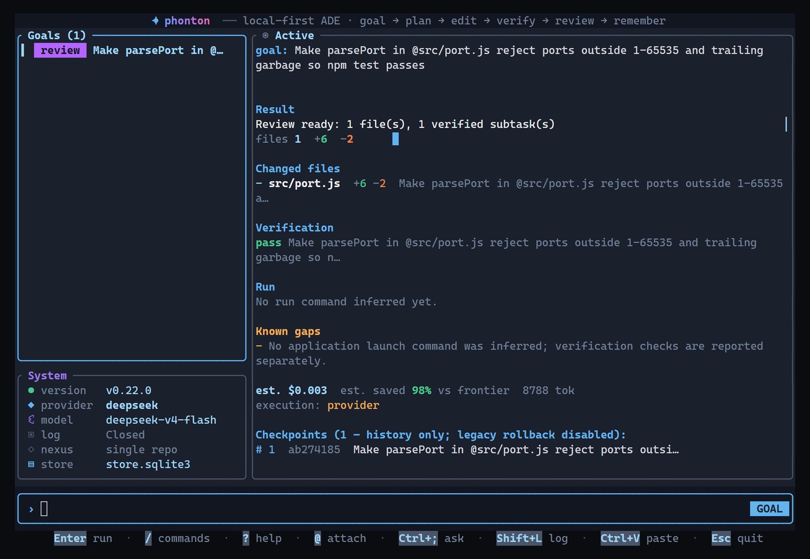

<p align="center">
  
</p>

<h1 align="center">Phonton CLI - v0.21.2</h1>

<p align="center">
  <strong>A local-first ADE for verified, accountable code changes.</strong><br>
  Phonton turns a goal into a visible plan, diff-only work, layered verification,
  reviewable receipts, and inspectable memory.
</p>

<p align="center">
  <a href="https://github.com/phonton-dev/phonton-cli/actions/workflows/ci.yml"></a>
  <a href="https://github.com/phonton-dev/phonton-cli/stargazers"></a>
  
  
</p>

---

## Quick Start

### Local harness preview (unreleased source build)

The current development branch adds a shared local model manager and a bounded
local candidate runner. These commands are not yet part of the published 0.21.1
package. See [local harness setup](docs/local-harness.md) for the exact workflow,
execution permissions, and current limits.

```powershell
phonton models status
phonton models storage  # inspect runtime, model, and coding-run storage
# Before setup, choose an existing empty folder on a roomy local drive if needed:
# phonton models storage D:/PhontonModels
phonton models endpoint  # inspect the selected local Ollama origin
phonton models catalog --snapshot  # see hardware behind fit and pre_setup_storage
phonton models setup
phonton models install qwen2.5-coder:1.5b
phonton models calibrate qwen2.5-coder:1.5b
phonton models select qwen2.5-coder:1.5b
# Later, deselect before removing the active model:
# phonton models deselect
# phonton models remove qwen2.5-coder:1.5b
phonton goal --local --plan "Fix parsePort validation" --repo C:/projects/example
$planPath = Join-Path $env:TEMP 'phonton-reviewed-plan.json'
phonton goal --local --plan "Fix parsePort validation" --repo C:/projects/example | Set-Content -Encoding utf8NoBOM $planPath
Get-Content -LiteralPath $planPath  # inspect scope, model, and checks
$planSha = (Get-FileHash -LiteralPath $planPath -Algorithm SHA256).Hash
phonton goal --local --reviewed-plan $planPath --sha256 $planSha --yes
phonton goal --local "Fix parsePort validation" --repo C:/projects/example
phonton goal --local --plan "Add a range helper" --repo C:/projects/example --new-file src/range.mjs
phonton goal --local --request request.json
phonton goal --local apply RUN_ID --yes  # after reviewing a verified candidate
phonton goal --local rollback RUN_ID --yes  # restore existing edits or remove a witnessed single creation on Windows
phonton goal --local list  # recent saved local goals, no model required
phonton goal --local show RUN_ID  # receipt, candidate evidence and Apply journal
phonton goal --local --help
```

Model commands also accept an untagged name, which resolves to Ollama's
`:latest` inventory entry. The examples use explicit tags so the chosen weights
are clear before calibration and selection.
Equivalent default-library spellings of that tag keep an existing calibration
usable when the runtime reports a different spelling. Phonton still checks the
installed digest and runtime version, and refuses ambiguous duplicate aliases.
The same rule applies to an already loaded model used for low-memory
calibration or generation, including calibration's final identity recheck.
Changed weights or an ambiguous alias still fail calibration. A failed
recalibration clears the old selection.

Plan preview includes the currently selected model, digest, calibrated context,
and a fingerprint of its full saved profile only after the installed model,
runtime version, and context metadata are confirmed live. If that check fails,
the source plan stays reviewable with a warning and a null model selection.
Desktop and the interactive CLI
show that selection before Run. Save the JSON outside the repository and use
`--reviewed-plan` with the SHA-256 recorded after inspection to bind the entire
plan across CLI invocations; add `--allow-host-checks` to that invocation only
after approving its proposed commands. If using an external loopback service,
add `--allow-unverified-runtime` on that invocation after accepting that it may
relay repository context outside this machine. Saved files cannot grant either
permission. If the file, selected model, installed digest, runtime version or
calibration changes, the saved plan refuses before creating an attempt. A direct
`--yes` invocation accepts a newly generated plan at that moment. `--plan`
remains available without a selected model and reports a null selection.

`models status` prints JSON. It also accepts `--json`, with or without an
explicit context (for example, `models status 8192 --json`).
Each valid calibrated profile row includes `profile_sha256`, the fingerprint
used by goal plan review. Recalibrating the same model changes that fingerprint
and requires a fresh goal plan before Run.
`models storage` reports the planned managed runtime, model, and new coding-run
evidence folders and current free space on that drive. On Windows x64, `models storage PATH` saves
an existing empty dedicated local-drive folder before managed setup. Desktop
offers the same choice. Phonton leaves existing managed files in place rather
than silently moving them. The saved choice is tied to that folder and volume;
if the drive is disconnected or replaced, reconnect the original before
continuing. New repository snapshots and check copies follow that folder;
older saved runs remain readable at their original location. An unused empty
choice can be changed. `PHONTON_LOCAL_STATE` keeps its runtime and run evidence
beside the isolated state file regardless of the saved normal-use choice.
Before setup, each manifest-backed `models catalog` entry may include
`pre_setup_storage`: the chosen root, observed free space, runtime setup
headroom, model bytes, pull reserve, total allowance and shortfall. It is
omitted when that root is used, unavailable, or cannot be measured. Choose a
roomier empty folder before setup when your intended model falls short; later
setup and pull admission still recheck live space.

Local coding checks use a complete copy of the Git-visible working tree, even
when the proposed edit names only one file. The bounded copy includes unrelated
assets so a check sees the same repository content; it accepts up to 1 GiB and
20,000 files. Windows estimates space for the baseline and candidate copies
before inference. A larger repository needs a smaller workspace for this local
runner; silently omitting files would make the verification result unreliable.

Choose a model from actual hardware readings; the example is not a universal
recommendation. The live catalog marks at most one resource-based first model
to try when a real manifest and current memory estimate support it. This is
not a speed or coding-quality result. The catalog also lists Qwen3.5 4B as an
untested candidate; calibrate it before selection. Installation contacts the
public registry. Phonton sends local-goal inference to a loopback endpoint.
A Phonton-started managed runtime disables Ollama cloud features; an external
loopback service can relay inference elsewhere and requires separate consent
for each goal.
On Windows, a Phonton-started Ollama service reports a verified model store
only while its original process still owns the loopback listener. Managed model
downloads check a fresh registry manifest against free space on that store's
volume; an external service's store remains unverified.
If Ollama is still responding but an earlier managed launch receipt cannot be
verified, setup reports recovery instead of claiming success. Stop the process
using the managed loopback port, reconnect the original storage folder if it
moved, then retry setup. Phonton does not stop an unverified process. Once the
port is free, setup can replace a stale regular receipt after checking saved
root identity and path safety. If a valid receipt remains, replacement model
storage is also blocked by its recorded directory identity.
Saving coding-run evidence with an explicitly external runtime marks a chosen
folder as used, but does not claim a prior Phonton-managed runtime launch.
Catalog manifest lookups run together; a slow entry no longer delays the start
of the other requests. Each unavailable manifest remains an error on its own
row, and the catalog still waits for the bounded batch before showing results.
If Ollama returns an incomplete installed-model entry, `models status` reports
the omitted row while retaining valid digest-backed models. Selection still
requires the selected model's current digest and calibration evidence.
If a status-only model metadata read times out, saved calibration can remain
visible with a context warning. Selecting a model and running a goal recheck
current metadata before inference.
Installed-model metadata shares a five-second status budget; the active model
is queried first, and slow or invalid rows show their own diagnostic without
serially delaying every other row.
Omitting calibration context lets Phonton choose a bounded setting from current
memory and the installed model's reported limit. `models status` labels each
cold-load estimate with its context; `models status 8192` previews an explicit
override. Unknown readings do not become a recommendation. You can still pass
an explicit 2048–32768 context to `models calibrate`.
If cold loading does not fit, calibration may retry with the exact installed
model already loaded in Ollama. The model must have enough context and at least
30 seconds before unload, while at least 1.5 GiB host RAM remains available.
Automatic context still requires the model's reported limit. Phonton rechecks
memory and resident identity before every probe; a loaded model is not reserved
for the duration of calibration. Probe results remain compatibility evidence.
`models status` keeps an incomplete calibration attempt separate from selectable
profiles. Finished probes are saved after each request, so cancellation, memory
pressure or an engine exit does not erase their diagnostic output. A retry runs
the probes again; an earlier passing profile remains until recalibration finishes.
The attempt's starting digest does not certify each later probe's weights.
Calibration keeps its format probes small. For coding goals, the saved profile
reserves up to one quarter of that context for each complete edit response;
the goal's shared token budget can reduce it further. When later attempts are
allowed, the runner keeps half the remaining token budget for them. This is a
generation allowance, not a measured claim that the model can produce a file
of that size. Existing profiles keep their saved ceiling until recalibrated.
Calibration first requests `think:false` so a thinking model can spend the
small edit-probe budget on the actual edit. If no edit format or no new-file
format passes, it also probes the runtime's default thinking behavior and
prefers a mode that demonstrated new-file creation. The chosen request mode
is saved in a schema-2 digest-bound profile and reused for tool-call probes,
coding edits, and strategy requests. Older schema-1 profiles retain their
original runtime-default request behavior until recalibrated. Probe
results show format compatibility, not general coding quality or proof that a
runtime honored the requested thinking setting.
On Windows, Phonton measures physical RAM through the OS API. PowerShell/CIM
adds an optional CPU name and is only a fallback for RAM, so a failed CIM probe
does not by itself leave model fit unknown. Available memory can change before
calibration or a goal runs.
On macOS, available RAM is estimated from `vm_stat` free, inactive and
speculative pages at the reported page size. Inactive pages may require paging
to reclaim, so this is a point-in-time fit estimate, not reserved memory. If
the counters cannot be read, fit remains unknown.
If both edit probes fail, their JSON remains inspectable, the CLI exits 2,
and Desktop shows the saved output while keeping model selection disabled.
For an existing Ollama runtime on another loopback port, use
`phonton models endpoint http://127.0.0.1:11435` before calibrating. Changing
origins clears the selected model. The runtime may be offline when the origin
is saved; `models status` reports its actual availability. Managed setup only
starts Phonton's default 127.0.0.1:11434 runtime.
If a service already answers there, setup labels its origin unverified; it does
not claim to have installed or started that service. A new managed start checks
that its own child owns the loopback listener before reporting success.
Before each strategy or edit request, the runner refreshes the runtime version,
installed model digest and size, and cold-load fit from current hardware. If
cold loading no longer fits, the exact calibrated model must be resident at the
required context with at least 1.5 GiB available host RAM. Ollama must report
at least 30 seconds before unload; residency is checked again immediately
before chat. These are point-in-time checks, not a memory reservation.
CLI download output coalesces byte updates while immediately showing stage
changes and completion; displayed byte counts come from the runtime.
Install reports completion only when the final pull event is success, the
requested tag appears in the installed inventory with a digest and size, and
the runtime returns local model metadata. The result includes that observed
digest and size. These are runtime reports, not an independent blob audit.
Setup, install and calibration can be cancelled, but a runtime action may have
completed before cancellation takes effect; refresh model status for incomplete
calibration evidence or installed-model changes before retrying.
Before install admission, Phonton saves the exact canonical tag and loopback
endpoint in local state. `models status` retains up to eight distinct,
unconfirmed requests across engine exits and checks each against the current
runtime inventory. A request may fail before transfer; its record does not
prove any bytes were downloaded. Retry with `phonton models install MODEL`
only after confirming the same endpoint and an absent model. Partial runtime
layers are not counted as installed or guaranteed reusable bytes. A verified
install removes its entry; unavailable or ambiguous inventory leaves the
outcome unresolved.
After interrupted managed setup, a retry waits up to one minute for an earlier
archive hash worker to release its file handle before retiring owned staging files.
Selection, deselection and removal finish once dispatched so their outcome is reported
instead of being guessed from a cancelled request.
`models deselect` works while the runtime is offline and keeps downloaded
weights and calibration. It clears the active selection so a later explicit
`models remove MODEL` can remove that model; removal can free only layers no
other installed model still uses.
Removal first checks that the installed model identity is unique and usable,
then reports success only after the runtime's installed inventory no longer
contains it. If aliases are ambiguous, inventory is incomplete, or the model
remains listed, Phonton keeps its saved calibration and asks for a status refresh.
Managed Windows runtime setup verifies the pinned archive and its extracted file
tree, publishes only a complete staging directory, and retries after an
interrupted Phonton-owned extraction. Unknown directories and older incomplete
final installs are preserved for inspection rather than replaced.
Setup measures free space on the runtime-installation volume. Managed model pulls
measure the verified running service's model-store volume before download;
external services remain unverified. If a full manifest estimate does not fit,
managed admission hashes existing complete blobs and credits only exact
manifest-size, SHA-256-matching files before remeasuring free space. Interrupted
Ollama partial files are not credited: a retry can still require more space,
and the error reports the additional bytes needed. The in-progress pull keeps
checking the original safety reserve. Refresh installed models after a pull
ends without a success confirmation before retrying.

The local runner retrieves bounded source excerpts within the reviewed file
scope. For a new-file goal with no `--files`, planning searches for matching
existing source and proposes it as read-only context; a no-match plan says when
the creation prompt has no repository excerpt. Receipts retain the exact
context, canonical diff and check evidence;
they distinguish context byte bounds from runtime-reported token usage.
Planning and excerpt selection recognize parsed identifiers across camelCase
and snake_case, such as `parsePort` and `parse_port`. Exact name matches rank
above naming-style variants; the proposed file scope still needs review.
The local engine exposes `local.run.list` to reopen recent saved goals in
Desktop. It records a bounded index beside local model state and can discover
older receipt-only runs; full evidence is still read by run ID.
CLI `goal --local list` and `show RUN_ID` use the same saved evidence without
starting a model. `show` marks evidence without a terminal record as
provisional because another engine may still be running; it never calls that
state a verified result.
Existing UTF-8 source without a final newline is included in plans and context.
The plan flags that EOF state, candidate edits preserve it, and review diffs
mark unterminated lines; new files still require a final newline.
Hosted semantic indexing caches embedding weights under the user's cache
directory, outside the active repository. Custom `FASTEMBED_CACHE_DIR` or
`HF_HOME` paths must be absolute and outside the indexed repository, even when
the process is started from a different directory; unsafe
paths leave semantic context unavailable without changing project files.
Repair prompts prioritize failed checks and retain their candidate identity when
later edits are unchanged or malformed.
Verbose baseline and candidate check logs keep marked start/end excerpts in
receipts. Repair feedback preserves trailing failures from stdout and stderr
within a smaller fixed budget; omitted middle output is not available to search.
The search controller compares failed-check identity and normalized output,
and tracks newly passing selected checks. A repair that gains a pass or moves
a failure to another check remains on that candidate branch for another
budgeted repair. Losing a pass without either signal restarts from baseline.
Ordinary and JSON-escaped Windows candidate paths are normalized for this
comparison; receipts retain the original bounded check output.
When a branch restarts, a separate bounded model call proposes a strategy tied
to an exact captured source span. It and the following edit spend the same call
and token budget; the proposal is recorded but never counted as a verified edit.
If an edit never produced candidate bytes and only one model call remains, the
controller can retry directly from the captured baseline without a strategy
call. It still stops on repeated identical rejected output; mixed new-file and
existing-file work keeps its multi-call reserve.
The same mechanism can be tried at a different reviewed path or source span;
repeating it at the same target stops that branch.
Module-style JS/TS files use complete parsed function spans where they fit, and
named failing-check evidence puts the relevant function first for the next edit.
Original Git staging has separate integrity evidence, with changes stopping the run.
The original Git-visible file inventory and captured bytes are also rechecked
after baseline checks, before generation and at final review; changed inventory
stops selection. Ignored files and external host effects remain outside this check.
Passing candidate checks first enters `finalizing`. Review readiness is saved
only after final model, captured baseline, source, candidate and Git-index
identity checks pass;
an atomic end record then makes that result available for Apply. A saved
review with no end record stays pending while live and is shown as interrupted
after an engine restart.
If a candidate check is interrupted, its pre-check diff and content hash remain
in the saved receipt. Unfinished checks are marked Unavailable, command journals
remain inspectable, and no candidate is selected for Apply. An orderly cancel
updates elapsed time through the cancellation point; a hard crash retains the
last saved timing observation.
Rust source with an inline test tail can be edited before that tail. Phonton
keeps the parsed test items, crate attributes, and macro/import scope fixed;
ambiguous layouts remain protected.
The default local check budget allows 16 launches. A reviewed host-approved
run needs room to check both baseline and candidate; a smaller explicit budget
is warned about in the plan and refused before execution.
After a failed candidate, another model call starts only if the remaining
approved-host check budget can cover preparation and every selected check on
the next candidate. Otherwise the run ends budget-exhausted with the earlier
check evidence; elapsed time or unavailable execution can still stop a check.
When a completed run is reopened, the engine rechecks its saved baseline,
selected candidate bytes, and canonical diff against the final receipt. If
that evidence is missing or changed, the old checks remain inspectable but no
candidate is selected for verified review or Apply. Apply also checks current
source, candidate, and Git-index identity before changing repository files.
For a reviewed SearchReplace plan with several editable paths, the implicit
budget reserves at least one model call per path and scales check/output
reserves within the worker's existing caps. The plan shows those numbers and
warns when the cap cannot cover a straight sequence. Repairs and restarts can
still spend calls before every path is edited; explicit budgets submitted for
plan review stay as supplied and receive capacity warnings instead of
automatic changes.
Guarded apply can replace the complete set of reviewed, verified existing scoped
files after rechecking source and index identity. It saves per-file original
bytes and a recovery journal without staging or committing. A multi-file batch
is recoverable after interruption, not atomic across files.
For schema-1/2 existing-file Apply journals, explicit rollback restores the
original backed-up bytes after rechecking the saved candidate, all current
source, recorded temporaries and Git index. It refuses observed later edits,
journals partial restoration, and never stages or commits. Resuming a schema-1
Apply also requires its intact original-byte backup before reporting success.
On Windows, an applied schema-3 journal can remove its single created file
after checking the retained hard-link identity anchor and deleting through a
held file handle.
Interrupted deletion has a separate journal marker; a replacement with a
different file identity is refused, even if its bytes match. A still-present
target after a recorded deletion attempt needs manual review. Applied schema-4
mixed create/edit journals on Windows restore the backed-up existing source
before removing the witnessed new file; interrupted source restoration can
resume from exact saved states. Prepared mixed Apply must first finish Apply.
Before publishing the new file, mixed Apply checks the creation path again.
If that check fails, it preserves the prepared journal and reports the path
validation error separately from a target that was already published.
Non-Windows created-file rollback remains manual. Older created-file journals
recorded only bytes and cannot prove that an identical path is still Phonton's
file. New journals retain a same-volume hard-link identity anchor in run
evidence or an ordinary local `.git` directory. If the anchor cannot be made
or its identity changes, recovery stops for manual inspection.
Git-directory anchors remain while run evidence may need recovery; deleting
run evidence by hand can leave an orphaned anchor file in `.git`.
Apply requests file and directory sync for new backups, creation anchors and
journal entries before project mutation; an unavailable sync stops Apply.
Before recording `applied` or `rolled_back`, it also requests sync of each
changed project directory. A failure after publication retains the prepared
journal for recovery. Baseline/candidate evidence and the complete operation
are not proven crash-durable, so sudden power loss still requires inspection.
Existing-file rollback does not exclude a concurrent file edit between its
final byte check and replacement; review the working tree afterward.
On Windows, Apply holds changed source parent directories against renames while
it replaces reviewed files; concurrent file edits still require its identity
checks.
An explicit `--new-file` plan can create one absent, untracked source file
under an existing parent. Existing `--files` paths remain read-only by default.
Add `--edit-existing src/caller.py` to review a bounded existing edit alongside
the new file. The first creation candidate is incomplete; only its child edit
can be checked and selected as a combined diff. Guarded Apply journals the
creation and existing replacements, refusing an occupied target or unknown
partial bytes. Its sequential writes can need explicit recovery after an
interruption. If the combined check fails, a budgeted repair may change the
created file or the reviewed existing files in its isolated parent, then rerun
the full check. Repair requires the created file to fit its source context and
rejects candidate-authored test definitions in every changed source before
running checks. Calibration records a separate tiny
creation-format probe; older or failed probes are labeled without claiming
creation quality from an existing-file edit result.
The runner protects common test scripts/configuration, including case aliases
of manifests on Windows and Node test-file naming patterns, and rejects opaque shell
checks. Passing selected checks is evidence for review, not proof that every
indirect test dependency is independent of the proposed edit.
The legacy Desktop goal runner requires an explicitly trusted project and denies
MCP operations until a separate approval flow exists; opening a project does not
grant trust. Failed planning is reflected in goal status when the run ends.
Desktop goal titles from the CLI service shorten long Unicode text on whole
characters.
The Desktop sidecar also reports active goal sessions from its running engine,
so a reloaded view can avoid restarting it while a goal is still in progress.
You can omit file scope to inspect a proposed scope and check plan. `--yes` accepts
the plan; executable host checks separately require `--allow-host-checks`.
Read-only discovery includes JavaScript/TypeScript module extensions. For
scoped Go source under a root `go.mod`, the plan proposes a separate
`go test -json -count=1` check for each edited package (up to four); it never
runs during preview. Add broader module or dependent-package checks explicitly
when they matter. The local Go path currently rejects build-constrained package
source (including assembly), files Go ignores by name, and cgo imports under
selected Go tests, even if an explicit check might include the file. A broad
`./...` test does not prove that a conditional source file was compiled. Go
test files and dependency manifests cannot be model edit targets in that local
run. Check proposals follow the editable language: a nested Go module or Node
package, or a mixed/unknown edit scope, needs an explicit check. Rust member
edits get their own manifest check, while a root Rust edit proposes a workspace
check. Conventional Node
test filenames and `test/` paths are protected from model edits. A supported
root npm script can propose a direct Node TAP check and add reviewed, offline
`npm ci` setup from a
captured lockfile. Setup runs in each separate check copy with lifecycle scripts
disabled, uses the same explicit host approval and budget, and is never counted
as a passing code check. Missing cached packages make setup unavailable; an
unsupported lockfile withholds an inferred test. Native dependencies that need
disabled lifecycle scripts can still cause a test failure requiring review.
Cargo test commands that compile or list tests without running them, or finish
with zero executed tests, produce **Not run** evidence instead of a verified
candidate. Missing or malformed Cargo test summaries do too, even on exit 0.
For a candidate using Cargo tests, the local runner also matches Cargo's
reported test binary to its candidate-local compiler dependency file **and**
a conservatively parsed module path. Every edited path must have both forms of
source-inclusion evidence, including Rust modules with nonstandard extensions.
Otherwise a separate **Not run** item keeps the candidate unverified even when
unrelated tests passed. Quiet Cargo output, an external target directory,
feature or macro ambiguity, and non-Rust edits may leave inclusion unproven;
choose an inspectable check that covers the whole changeset. File inclusion
does not prove the changed behavior has a meaningful assertion.
The verifier identifies Cargo's actual subcommand; a successful
`cargo run -- test` passes `test` to the binary and remains **Not run**.
Their output and exit code remain available for review.
An exit-zero command that does not run a supported candidate test or an
explicit candidate-local script is **Not run** rather than passing verification.
For example, `python --version`, `go version`, `cargo build`, and `git status`
remain diagnostic command evidence. A direct `python test_add.py` or
`node test_add.js` script can still be selected, but its exit code is the
script's reported result, not independent proof that it asserted the changed
behavior. For edited JavaScript or TypeScript, a script exit alone cannot
qualify the candidate for Apply. Review the script and candidate diff.
Direct `node --test` checks need an explicit TAP reporter and output showing a
completed named test; empty, skipped-only and spec-reporter runs remain
**Not run** even when Node exits 0. A supported root npm script is used to
propose that direct Node command. Explicit `npm test` stays diagnostic-only on
exit 0 because npm may change the executable or shell. Other Node runners need
separate review.
When a candidate edits JS/TS source, a passing direct Node TAP check also needs
V8 coverage output showing every edited source file loaded from the complete
candidate, including edits retained through a repair or mixed-file creation.
An unrelated passing test adds separate **Not run** source-inclusion evidence.
Phonton records only the inspected inclusion result; the test process can still
forge coverage, and loading a file does not prove the changed behavior was
asserted. Transpilers that report only generated files leave original source
inclusion unproven and the candidate unverified.
The reviewed plan warns before execution when its selected checks cannot
establish this inclusion, or when transformed source may hide exact file identity.
Passing checks retain the candidate-relative paths matched by their V8 report
in the saved receipt. Older JS/TS reviews without this verifier policy are
unavailable for Apply on reopen; rerun the goal with the current engine.
For edited `.py` source, a passing direct Python `unittest`, pytest, or
candidate-local script check also needs a private process-reported execution
trace showing every exact edited file loaded from the complete candidate. The
hook records only those reviewed file paths, so unrelated Python imports do
not consume its trace limit. An interpreter's existing `sitecustomize` is
chained before the selected command runs.
Phonton adds separate **Not run** evidence when an unrelated test passes or
the trace is absent, malformed, or incomplete. The selected command and its
output remain visible. Python `-I`, `-E`, and `-S` can prevent the tracing hook
from loading; a candidate `sitecustomize` conflict leaves the command unchanged
and inclusion unverified. The plan warns about this before host approval.
Executing a file does not prove its behavior was asserted, and project code
can still forge process output. Older Python reviews without this policy are
unavailable for Apply on reopen; rerun the goal with the current engine.
Python `unittest` runs that collect no tests, report only skips or expected
failures, or exit successfully without a runner summary also remain **Not run**,
with their output and exit code visible. At least one ordinary passing test is
needed for a reported pass. Inferred checks add direct discovery roots for
nested test directories without `__init__.py`; root discovery alone would skip those tests.
More than four separate roots need explicit commands.
Pytest-style tests or configuration propose `python -m pytest --color=no`
instead of `unittest discover`. When filename discovery could skip a recognized
test, the plan adds a separate explicit-file pytest check. Configured pytest
projects also get that check for recognized files. Oversized explicit lists are
withheld for manual selection. The explicit check clears project `addopts` so
they cannot replace a named file with a broader passing suite; the separate
root check still uses project options. A repository module that would shadow
`pytest` or `unittest` withholds inferred checks. An explicit `python -m`
check for either runner is also refused if a repository-local module could
replace it in the candidate check copy. A successful pytest check needs a final summary
with at least one passed test; collection-only, skipped-only, and missing or
unrecognized summaries remain **Not run**. Standard ANSI-colored summaries are
accepted. Python must receive `-m pytest` before any script or inline-code
operand; later tokens are script arguments, not a direct pytest invocation.
Pytest must be available in the
approved host environment; planning does not install it. A missing pytest
module is **Unavailable**, distinct from a failing project test.
These commands are selected-check evidence, not proof that every named file ran:
pytest configuration or plugins can still deselect cases. Review collected tests.
Before a direct pytest check runs, Phonton checks captured `pytest.ini`,
`pytest.toml`, `pyproject.toml`, `tox.ini`, and `setup.cfg` settings for
`testpaths`, `pythonpath`, and `addopts` that leave the candidate. Such a plan is
refused: a pass from the original repository would not verify candidate bytes.
An explicit `-c` config is checked even if it has another filename. Nested
configs are checked when the selected test paths can load them. Command-line
`-o` overrides receive the same path check, including quoted values.
Configured or overridden `addopts --pyargs` is refused for the same reason.
Dynamic plugins and test imports still need review.
Wrapped pytest commands such as `uv run pytest` are diagnostic-only on exit 0;
select the interpreter in the environment directly for verification.
Python and Node inline-code flags, including attached forms such as `-cCODE`
and `-eCODE`, are refused as verification commands. Interpreter `.cmd` and
`.bat` wrappers are also refused because they can change which runner executes.
Local goal checks reject command paths that leave the candidate copy, including
parent-relative paths, rooted arguments, file URLs, and paths inside flag values
or space-separated path lists. Use paths within the candidate repository;
this static check does not inspect arbitrary scripts or attest that a passing
runner exercised the changed code.
Pytest `--pyargs` is refused because it can select an installed package.
Unittest module selectors and discovery roots must resolve inside the candidate.
Go checks need uncached JSON output with a completed named leaf test. Plain
`go test` success, skipped-only suites, and cached results remain **Not run**;
select `go test -json -count=1` for explicit Go checks. The same evidence rule
applies when `go -C . test` is used; another `-C` target cannot verify the
candidate and remains **Not run**. Explicit Go package targets must be `.` or
start with `./` so a standard-library or remote package cannot stand in for
candidate tests. Go runner replacement flags (`-exec`, `-toolexec`, and
`-overlay`) are refused as verification checks.
For a candidate using Go tests, the runner also requires each edited `.go`
file's root-module package to report a terminal pass in a selected
candidate-relative check.
Passing tests in another package leave a separate **Not run** source-inclusion
item, even if the selected command exited successfully. A nested module or an
unreadable module identity also leaves inclusion unproven. A package pass
shows that Go built the selected package under the current source exclusions;
it does not prove a test asserted the edited behavior.
Assembly, cgo headers, and other non-`.go` package source remain **Not run**
under selected Go tests because a package result does not attest their file-level
inclusion.
Direct local `cargo test` checks refuse `--config` overrides and Cargo
configuration that selects a target runner or includes other config files.
Phonton reads applicable repository, ancestor, and Cargo-home config before
admission and again from the candidate immediately before the check. A runner
could replace the compiled test executable and print a passing footer without
running it. Ordinary Cargo settings without those overrides remain usable.

Hosted goals fail closed at executable verification when isolation is unavailable.
`--allow-host-checks` explicitly permits repository checks on the host after you
review the repo and commands; `--yes` alone does not grant that authority. For
scoped local goals, use the local request's explicit command list and approval.
Host checks observe the command's exit status, but candidate code can terminate
an in-process runner or forge its output. A reported pass is not independent
attestation that every test ran; inspect the exact diff and check logs before
applying a candidate.
With `goal --local --request`, a saved approval flag cannot authorize a later
run; pass `--allow-host-checks` on that invocation to approve host setup/checks.

```powershell
npm install -g phonton-cli
phonton doctor --provider
phonton config edit   # add your provider API key if doctor asked for one
phonton goal "fix the failing npm test in this repo" --allow-host-checks
```

Smallest verified loop (this repo): `fixtures/add-one`. See that folder's README.

Headless benchmark-style runs:

```powershell
phonton goal --prompt-file prompt.md --yes --json --allow-host-checks
phonton review latest --json
phonton benchmark export --latest
```

Hosted `review approve` records Done only while a verified Reviewing task still
matches its Git checkpoint, staged files and worktree. Hosted edits are already
staged before this review; `review reject` records Rejected but leaves those
files for manual handling. Legacy checkpoint rollback is disabled because its
reset could discard unrelated work. This is separate from the local runner's
explicit, journaled Apply and rollback commands.
For a project inside a larger Git checkout, run hosted goal and review from the
same project directory. Phonton applies project-relative hunks there and stages
their corresponding Git-root paths.
For `phonton goal --local apply RUN_ID --yes` or `rollback RUN_ID --yes`, run
the command from the saved run's repository. The engine checks the current
directory against that repository before changing source or recovery state.

`--yes` accepts workspace and MCP prompts in headless runs. Repository checks
execute project code on the host only when you separately pass
`--allow-host-checks`; review the repo and its check commands first. The old
`--permission-mode` argument is rejected because it never controlled execution.

When a run finishes, open the **Receipt** focus in the TUI (or `phonton review
latest`) for changed files, verification evidence, run commands, known gaps,
and rollback points. Use `/why-tokens` to see index, memory, and attachment
contributions.

---

## What Is Phonton?

Phonton CLI is a local-first agentic development environment (ADE), not a
generic chatbot. It is built around the accountable development loop:

```text
goal -> plan -> edit -> verify -> review -> remember
```

You bring your own model keys or local model runtime. Phonton runs locally,
keeps its state in local files and SQLite, and sends selected task context only
to the provider or local model you configure. There is no Phonton-hosted proxy
between your workspace and your chosen provider.

<p align="center">
  
</p>

---

## Why Phonton?

### Visible Goal Contracts

Before broad work starts, Phonton turns the request into a `GoalContract` with
acceptance criteria, expected artifacts, likely files, verification commands,
assumptions, and clarification questions.

### Interactive Clarification Questionnaire

v0.19.6 integrates a fully Interactive Clarification Questionnaire inside the TUI. When requirements are under-specified (confidence < 70% or unanswered questions), execution suspends, guiding the user step-by-step directly in the terminal, automatically appending answers to the prompt, and initiating a clean planning rerun.

### Diff-Only Workers

Workers produce code changes as diffs. Phonton does not treat worker prose as
the primary artifact, and unverified changes are not promoted as review-ready.

### Layered Verification

Phonton verifies changes with the checks that fit the workspace: patch
applicability, syntax checks, memory/decision checks, Cargo checks and tests,
Node test scripts, and browser rendering checks for web projects when
applicable.
For hosted Rust goals with approved host checks, package tests are resolved
from the selected repository. A passing Cargo test run is recorded as a Test
layer only when its output shows at least one completed test; a library-only
crate does not receive a `cargo run` instruction in its handoff.

### Typed Handoff Packets

After verification, Phonton writes a typed `HandoffPacket` with changed files,
verification evidence, run commands, known gaps, rollback points, token/cost
summary, and context influence. Review starts from evidence rather than a chat
summary.

### Local Memory And Code Retrieval

Phonton stores task history, decisions, rejected approaches, and conventions in
local SQLite. Code context is retrieved through local symbol indexing and HNSW
search by default, with an optional Qdrant backend for code retrieval in larger
workspaces.
Retrieved prior context stays in the worker prompt; new completion memories,
review descriptions, and checkpoint labels use only the current task text.
Memory lookup is still keyword-based across the local store, so review any
prior-context suggestion before treating it as relevant to this repository.

### BYOK Providers And MCP Approval Gates

Phonton supports Anthropic, OpenAI, OpenRouter, Gemini, Ollama, AgentRouter,
Cloudflare, DeepSeek, xAI/Grok, Groq, Together, and custom OpenAI-compatible
endpoints. MCP servers and extension packs are inspectable local config, and
networked or mutating tool use goes through approval-aware flows.

---

## Quick Install

Install from npm:

```bash
npm install -g phonton-cli
phonton version
phonton doctor
```

Install this exact release from source:

```bash
cargo install --git https://github.com/phonton-dev/phonton-cli --tag v0.19.6 phonton-cli --locked --force
```

Alternative installers:

```bash
curl -fsSL https://raw.githubusercontent.com/phonton-dev/phonton-cli/main/scripts/install.sh | sh
```

```powershell
& ([scriptblock]::Create((irm https://raw.githubusercontent.com/phonton-dev/phonton-cli/main/scripts/install.ps1)))
```

---

## v0.19.6 Highlights

- Beautiful, guided Interactive Clarification step questionnaire (`Mode::Clarify`) directly inside the Ratatui TUI.
- Automatic prompt self-refinement by appending answers to the original goal description.
- Programmatic plan-rerun queueing with strict state, flight log, and checkpoint cleanup to prevent state leaks.
- Full verification coverage via new automated TUI unit testing.

Recent v0.19.x work also includes typed swarm planning metadata, conflict-group
scheduling, pluggable local/Qdrant code retrieval, MCP capability previews,
browser verifier cleanup, TUI version display, and auto-update controls.

---

## Commands

```bash
# Launch the interactive Ratatui TUI
phonton

# Run a goal non-interactively through plan/edit/verify/review
phonton goal "add input validation to config loading" --yes --allow-host-checks

# Run an exact prompt file, useful for benchmark and CI harnesses
phonton goal --prompt-file prompt.md --yes --allow-host-checks --json

# Preview the task graph and GoalContract without editing files
phonton plan --json "refactor auth layer"

# Audit configuration, providers, store, trust, git, Cargo, and index backend
phonton doctor --provider

# Export evidence from the latest run
phonton benchmark export --latest --format json

# Inspect MCP capability proposals without invoking tools
phonton mcp capabilities <server-id> --json
```

---

## Configuration

Configure providers and the code index in `~/.phonton/config.toml`:
Set `PHONTON_CONFIG_PATH` to an absolute config path outside repositories for
an isolated CLI run. Local-model state stays at its usual location unless
`PHONTON_LOCAL_STATE` is also set. Provider keys can remain in process
environment variables instead of the isolated file; config-file keys take
precedence when present. The normal config is left untouched.

```toml
[provider]
name = "deepseek"
model = "deepseek-flash"

[provider.keys]
deepseek = "sk-deepseek-api-key-here"
anthropic = "sk-ant-api-key-here"
openai = "sk-proj-openai-key-here"

[index]
backend = "local-hnsw"
```

Optional Qdrant code retrieval:

```toml
[index]
backend = "qdrant"
qdrant_url = "http://127.0.0.1:6333"
qdrant_collection = "phonton-code"
```

---

## Benchmark Honesty

Phonton is designed for context efficiency and accountable verification, but
public comparisons require reproducible evidence: pinned fixtures, exact
prompts, tool versions, model/provider names, provider-reported token usage
where available, raw logs, final diffs, verification logs, quality review, and
handoff evidence.

Do not treat local-template runs, estimates, or incomplete artifact sets as
token-efficiency wins.

---

## Crate Architecture

- `phonton-cli`: TUI, headless goal runner, benchmark export, and CLI commands.
- `phonton-types`: shared GoalContract, HandoffPacket, PlanGraph, events, and provider types.
- `phonton-planner`: goal decomposition, contract generation, and plan graph metadata.
- `phonton-orchestrator`: task scheduling, confidence gate, retries, verification, and handoff assembly.
- `phonton-worker`: context assembly, provider calls, diff-only output, repair prompts, and MCP flow.
- `phonton-index`: local HNSW symbol/code retrieval plus optional Qdrant retrieval.
- `phonton-verify`: patch, syntax, decision, Cargo, Node, and browser verification.
- `phonton-memory` and `phonton-store`: local memory facade and SQLite persistence.
- `phonton-sandbox`: command and tool execution guardrails.
- `phonton-extensions` and `phonton-mcp`: local extension loading and MCP runtime.

---

## License

Licensed under either of:

- Apache License, Version 2.0 ([LICENSE-APACHE](LICENSE-APACHE))
- MIT License ([LICENSE-MIT](LICENSE-MIT))

At your option.
